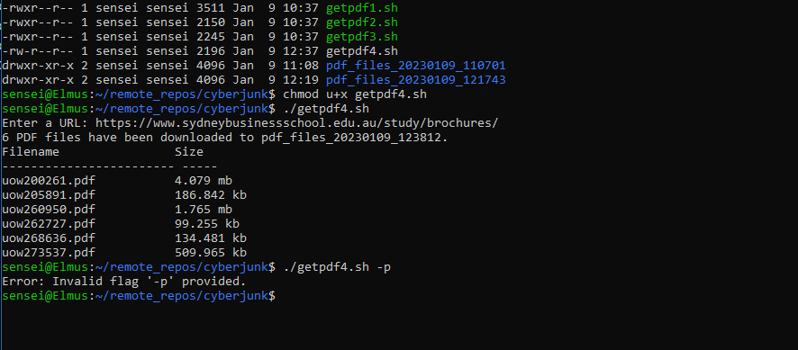

# cyberjunk

Script(s) that download all hyperlinked .pdf files they find at a user-provided URL.

Student's Full Name and Reg No. was a necessity at the top of the script for the Partial fulfillment of degree in Software Engineering, under scripting languages. 

This is a form of web-scrapping, only that it gets .pdf links and files available in a provided url.

For this code to execute, you must have good internet connection and must be  run in VS Code for Linux on an Ubuntu Desktop 18.0.4 LTS/GNU bash v5.0.17 instance or higher and any appropriate installation of wsl distro

# NOTE: 
The first file without a number preceding .sh executes smoothly and satisfies all the script requirements but for any invalig flag e.g *./getpdf -p instead of ./getpdf -z* , the error is displayed at the end of code execution.

The fifth file saved *getpdf4.sh* gives an error e.g *Error: invalid flag '-p' provided* if any invalid flag is provided at the start and no execution takes place further. 

The other scripts (from *1.sh - *3.sh) are a replica but have minor issues that need addressing, they will execute yes but will exit with error codes... "This is a *buffer contigency protocol* for anyone who wishes to practice troubleshooting the script" 

From (files *5.sh - *8.sh), there are minor add-ons, different script structures and functions to make it better or aesthetic for the user but the scripts' intents and functionalities remain intact.

The getpdf3.sh has an addon at the end that checks if any directories or files were left behind after script execution.

*KINDLY FIX ANY ERRORS ASSOCIATED WITH THE SCRIPTS AT YOUR ON PLEASURE.*
